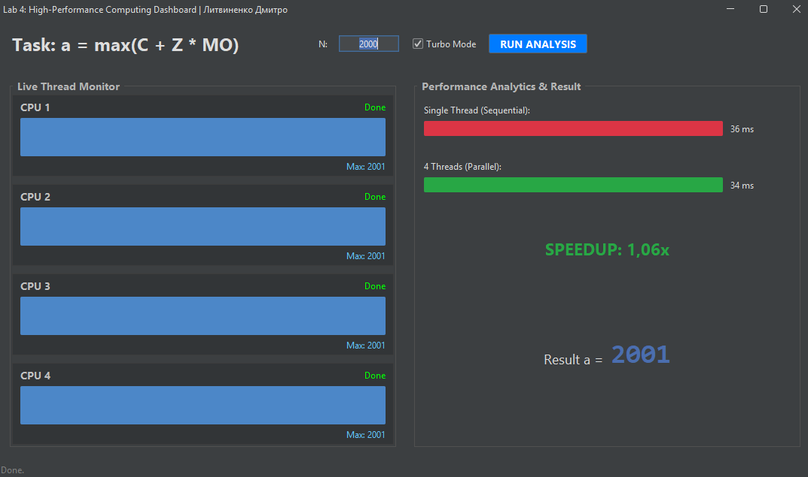

# Parallel Monitor System (Java Swing) ⚡

**Практична робота № 10** | "Монітори в мові Java. Взаємодія потоків через спільну пам'ять."


## 📋 Опис завдання

Розробка багатопотокової програми для обчислення математичного виразу в системі з **4 процесорами** (потоками) з використанням патерну проектування **"Монітор"** (Monitor Pattern) для синхронізації доступу до спільних ресурсів.

### 🧮 Формула обчислення
$$a = \max(C + Z \cdot MO)$$

Де:
* $a$ — скаляр (результат).
* $C, Z$ — вектори розмірності $N$.
* $MO$ — матриця розмірності $N \times N$.

## 🚀 Функціонал

Програма реалізує професійний **Dashboard** для моніторингу та аналізу продуктивності:

* **Live Thread Monitor:** Візуалізація роботи кожного з 4-х потоків у реальному часі.
* **Benchmark Mode:** Порівняння швидкодії послідовного (1 потік) та паралельного (4 потоки) алгоритмів.
* **Speedup Analysis:** Автоматичний розрахунок коефіцієнта прискорення (Speedup).
* **Turbo Mode:** Режим максимальної продуктивності (вимкнення анімації для точних замірів).
* **GUI:** Сучасний темний інтерфейс на базі бібліотеки **FlatLaf**.

## 📸 Скріншоти


*(Приклад роботи програми в режимі Benchmark)*

## 🛠 Технічні деталі

* **Мова:** Java.
* **Синхронізація:** `synchronized` методи, `wait()`, `notifyAll()`.
* **GUI:** Java Swing + FlatLaf Library.
* **Збірка:** Custom Native Build (Fat JAR + IExpress).

### Структура монітора (Клас `Data`)
Клас `Data` забезпечує потокобезпечний доступ до змінних $a, C, Z, MO$. Потоки синхронізуються за допомогою подій:
* `Signal_Input` — дані завантажено.
* `Signal_Calc` — потік завершив роботу.

---

## ⚙️ Як запустити

### Спосіб 1: Windows (Рекомендовано)
Завантажте файл **`Lab4.exe`** і запустіть його.
* *Примітка: Java має бути встановлена на комп'ютері.*

### Спосіб 2: Java JAR
```bash
java -jar Lab4.jar
````

### Спосіб 3: Компіляція з коду

Детальна інструкція зі збірки проекту та створення EXE файлу знаходиться у файлі [BUILD.md](BUILD.md).

```bash
# Швидка компіляція та запуск
javac -cp ".;flatlaf-3.6.2.jar" MainClass.java
java -cp ".;flatlaf-3.6.2.jar" MainClass
```

## 📂 Структура проекту

  * `MainClass.java` — Головний клас, GUI та логіка запуску.
  * `Data` — Клас-монітор (спільний ресурс із `synchronized` методами).
  * `WorkerThread` — Логіка роботи окремого потоку.
  * `SequentialCalc` — Алгоритм для однопотокового тесту.

## 👨‍💻 Автор

**Литвиненко Дмитро**
Студент групи I-23
Міжнародний науково-технічний університет імені академіка Юрія Бугая
